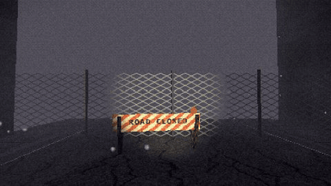
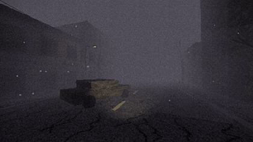
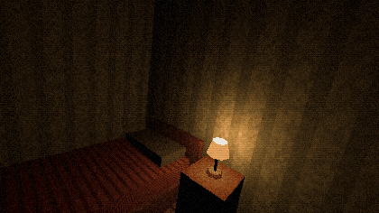

# threejs-psx-shader

PS1-style rendering for Three.js: low resolution rendering, ordered
dithering, reduced color depth, screen-space fog, CRT filter, vertex
snapping and affine texture mapping. The effects run as post-processing
passes and material patches.



---



---



## Credits

Based off Unity3D psx shader:
[URP-PSX-FORKED](https://github.com/Math-Man/URP-PSX-FORKED)

## Installation

The package is a plain ES module folder with `three` as its only
dependency. Copy the folder into your project, or install it with npm
from a checkout of this repository.

## Usage

```js
import * as THREE from 'three';
import { PSXPipeline, applyPSXMaterial } from './threejs-psx-shader/index.js';

// keep antialiasing off so edges stay aliased
const renderer = new THREE.WebGLRenderer({ antialias: false });
renderer.setPixelRatio(1);

const psx = new PSXPipeline(renderer, scene, camera);
psx.setSize(window.innerWidth, window.innerHeight);

const clock = new THREE.Clock();

window.addEventListener('resize', () => {
  renderer.setSize(window.innerWidth, window.innerHeight);
  psx.setSize(window.innerWidth, window.innerHeight);
});

function animate() {
  requestAnimationFrame(animate);
  const dt = clock.getDelta();
  // instead of renderer.render(scene, camera):
  psx.render(dt);
}
```

This creates the default chain (fog, dithering, pixelation, CRT) with
reasonable defaults. Vertex snapping and texture warping are material
effects, so they are applied to materials directly:

```js
const material = applyPSXMaterial(
  new THREE.MeshLambertMaterial({ map: texture }),
  { snap: true, affine: 0.75 }
);
```

## Configuration

Each effect lives in its own file under `src/effects/`, and its
options are documented in the header comment of its class file. Effects
expose a plain `settings` object that can be read and written at any time, which also
makes them easy to wire to lil-gui or dat.gui:

```js
psx.getEffect('pixelation').settings.resolutionHeight = 240;
psx.getEffect('pixelation').settings.steps = 32;      // color levels per channel
psx.getEffect('dithering').settings.pattern = 'psx';  // the PS1 GPU pattern
psx.getEffect('fog').settings.density = 0.05;
psx.getEffect('fog').settings.color = '#8f949c';
psx.getEffect('crt').settings.bend = 8;
psx.getEffect('crt').enabled = false;                 // disable a single pass
psx.enabled = false;                                  // bypass the pipeline
```

| Effect | File | Description |
| --- | --- | --- |
| Pixelation | [`PixelationEffect.js`](src/effects/PixelationEffect.js) | renders the scene at low resolution and reduces color depth |
| Dithering | [`DitheringEffect.js`](src/effects/DitheringEffect.js) | 4x4 ordered dithering, including the pattern used by the PS1 GPU |
| Fog | [`FogEffect.js`](src/effects/FogEffect.js) | depth-based fog with animated noise |
| CRT | [`CRTEffect.js`](src/effects/CRTEffect.js) | screen curvature, vignette, scanlines, grain, chromatic aberration |
| Material | [`PSXMaterial.js`](src/PSXMaterial.js) | vertex snapping and affine texture mapping for materials |

The chain can also be built by hand, with only the effects you want, or
extended with your own passes by subclassing `PSXEffect` (see
`src/PSXEffect.js`):

```js
import { PSXPipeline, PixelationEffect, DitheringEffect } from './threejs-psx-shader/index.js';

const psx = new PSXPipeline(renderer, scene, camera, {
  effects: [
    new PixelationEffect({ resolutionHeight: 180 }),
    new DitheringEffect({ pattern: 'bayer' }),
  ],
});
```

### Using a single effect

Effects depend only on the `PSXEffect` base class, never on each other,
so a single effect can be imported directly and the rest of the package
stays out of your bundle:

```js
import { DitheringEffect } from 'threejs-psx-shader/src/effects/DitheringEffect.js';
```

Nothing in the package modifies the renderer, the scene or any global
state on import. Effects only run once a pipeline is constructed and
`render()` is called, so the package can be combined with other
post-processing setups.

## How it works

The scene is rendered into a small internal frame buffer (roughly
320x240 by default) and upscaled to the canvas with nearest-neighbour
sampling. The pixelation is real rather than simulated: geometry edges
come out aliased because the scene is actually rendered at that
resolution, not filtered afterwards.

The passes run in a fixed order. Fog runs first, in linear color space,
so it blends the same way as Three.js scene fog. The image is then
converted to display values, and dithering and color reduction happen
there; this matches the original hardware, which dithered and truncated
to 15-bit color at output. The CRT pass runs last at full window
resolution, so scanlines and the grille stay one pixel wide instead of
being scaled up with the image.

Vertex snapping and affine texture mapping need access to the geometry,
so they are injected into standard Three.js materials through
`onBeforeCompile` instead of running as a screen pass. One deliberate
difference from the original hardware: unrestricted affine mapping
distorts heavily on large polygons (PS1 games worked around this by
tessellating their geometry), so the warp here is clamped and fades out
near the camera. Details are in the comments in
[`PSXMaterial.js`](src/PSXMaterial.js).

## Recommendations

- Create the renderer with `antialias: false` and `setPixelRatio(1)`.
- Use small textures (32 to 128 px) with `THREE.NearestFilter`.
- `MeshLambertMaterial` fits the period better than PBR materials.
- Subdivide large floors and walls into triangles of roughly 2 m so
  vertex snapping and texture warping stay subtle.
- Keep the far plane short and let the fog cover the horizon.

## License

MIT. See [LICENSE](LICENSE).
